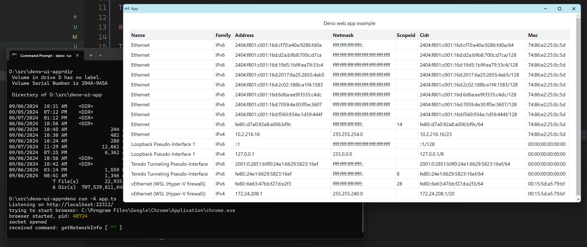
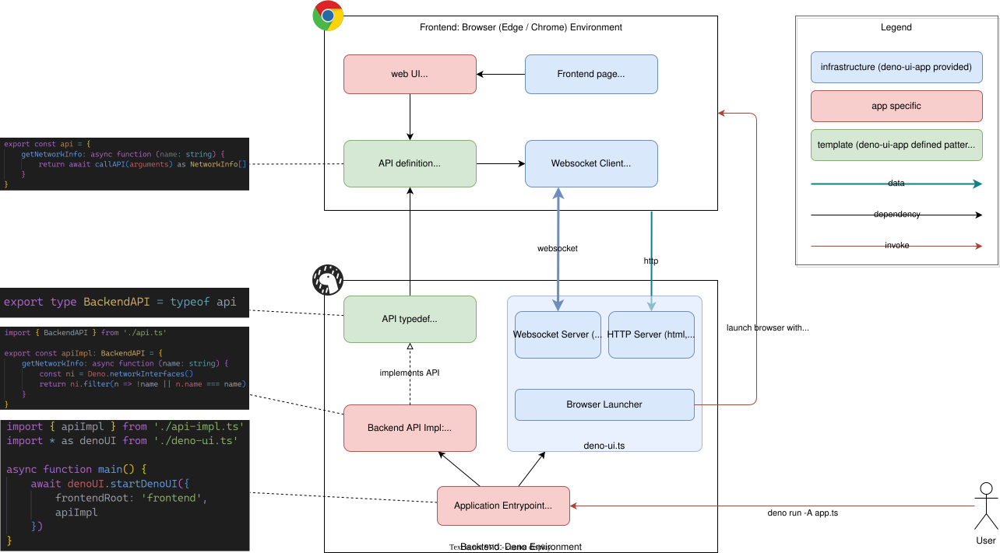
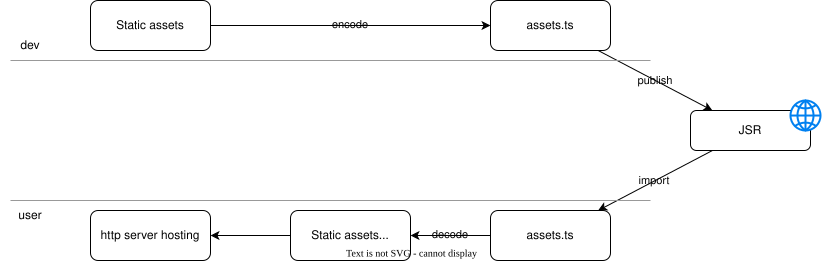
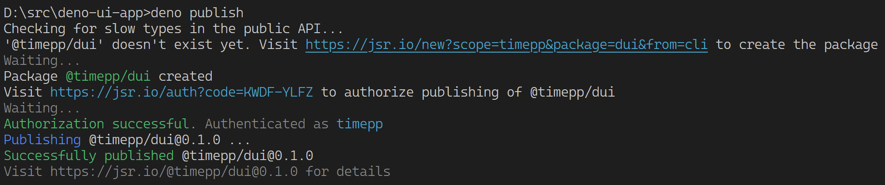

# Deno Web app

This is a template for building native applications using modern tech stack:

- Use web technologies (HTML, CSS, JS) for the frontend
- Use Deno for the backend
- Leverage existing browsers (Fully tested on Edge and Chrome) for hosting the UI
- Use typescript for both frontend and backend
- Be able to publish as JSR component, so that it can be used without any downloading/installation

This template is at the same time a demo showing all network interfaces.

## Run the demo

To run the demo from jsr directly:

```bash
    deno run -A jsr:@timepp/dui
```

To run the demo locally, clone the repo and run

```bash
    deno run -A app.ts
```



pre-requisite:

- deno
- Edge or Chrome

## Architecture



### API invoking

API invoking is done by websocket message. Websocket is also used to prove presence of the backend/frontend. The backend and frontend all together behaves as a single app:

- If the backend is killed, the frontend will close as well.
- If there is no frontend connected, the backend will exit as well (after a short delay).

### Vite dev server

### Hosting app in JSR

Although we can import remote code from JSR, static assets (HTML, CSS and other types) are not able to be downloaded by `imports`. However, we can encode all the static assets into one json file which can be imported from typescript. The http server will decode them in memory and serve them as if they are static assets.



The script `build.ts` will build frontend using vite and encode all files under `frontend/dist` into `assets.ts` for remote loading.

## Build your own app

After cloning the repo, you can start building your own app very quick by following the steps below.

You define API interfaces between the web client and the backend script in `api.ts`:

```typescript
export const api = {
    getNetworkInfo: async function (name: string) {
        return await callAPI(arguments) as NetworkInfo[]
    }
}

export type BackendAPI = typeof api
```

Note that we follow the DRY principle whenever possible. Above code do the following at the same time:

- Define the API interface: `getNetworkInfo (name: string) ... as NetworkInfo[]`
- Implement the API at frontend: `return await callAPI(arguments)`
- Derive the API for the backend: `export type BackendAPI = typeof api`

All the major part of the API (signature, input params and return type) is written exactly once.

Then you implement the API in `api_impl.ts`:

```typescript
import {api} from './api.ts'

export const apiImpl: BackendAPI = {
    getNetworkInfo: async function (name: string) {
        const ni = Deno.networkInterfaces()
        return ni.filter(n => !name || n.name === name)
    }
}
```

API name and signatures are written again here. **This is the only place where you need to repeat**. But since `apiImpl` implements `BackendAPI`, you will get a compile time check in case anything mismatch.

You use the API in frontend code:

```typescript
import {api} from '../api.ts'
...
const networkInfo = await api.getNetworkInfo('')
...
```

Finally, in the app entrypoint, you call `startDenoUI`, passing the API implementation:

```typescript
import {startDenoUI} from './deno_ui.ts'
import {apiImpl} from './api_impl.ts'
async function main() {
    await denoUI.startDenoUI({
        frontendRoot: 'frontend',
        apiImpl
    })
}
main()
```

`startDenoUI` will start the http server, websocket server and launch browser to navigate to the corresponding web address.

If you want to publish you app to JSR:

1. change the information(package name, version, etc) in `jsr.json'
2. run `deno run -A build.ts` to build the frontend and encode the assets
3. commit your local changes
4. run `deno publish` and follow the instructions

A successfully output is similar to the following for the first time of publish:

